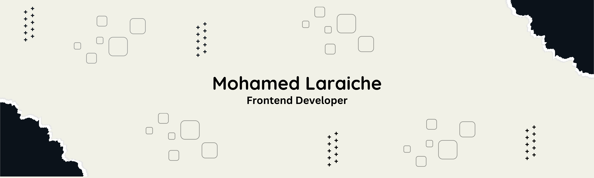

<h1 align="center">Hi 👋, I'm Mohamed</h1>
<h3 align="center">A Self-taught Frontend Developer</h3>

  

  

- 👨‍💻 All of my projects are available at [https://www.molaraiche.com/projects](https://www.molaraiche.com/projects)

- 💬 Ask me about **React.js and Next.js**

- 📫 How to reach me **laraichemohamed@gmail.com**

- 📄 Know about my experiences [https://docs.google.com/document/d/1cyNEi2iPMT7VvgnVwX4QpNQGqn7bviDqb25BzOgZYQw/edit?tab=t.0](https://docs.google.com/document/d/1cyNEi2iPMT7VvgnVwX4QpNQGqn7bviDqb25BzOgZYQw/edit?tab=t.0)

<h3 align="left">Connect with me:</h3>

<h3 align="left">Languages and Tools:</h3>

               

